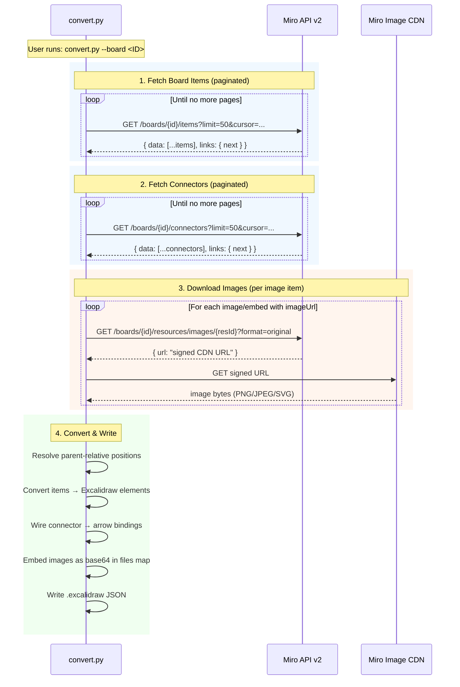
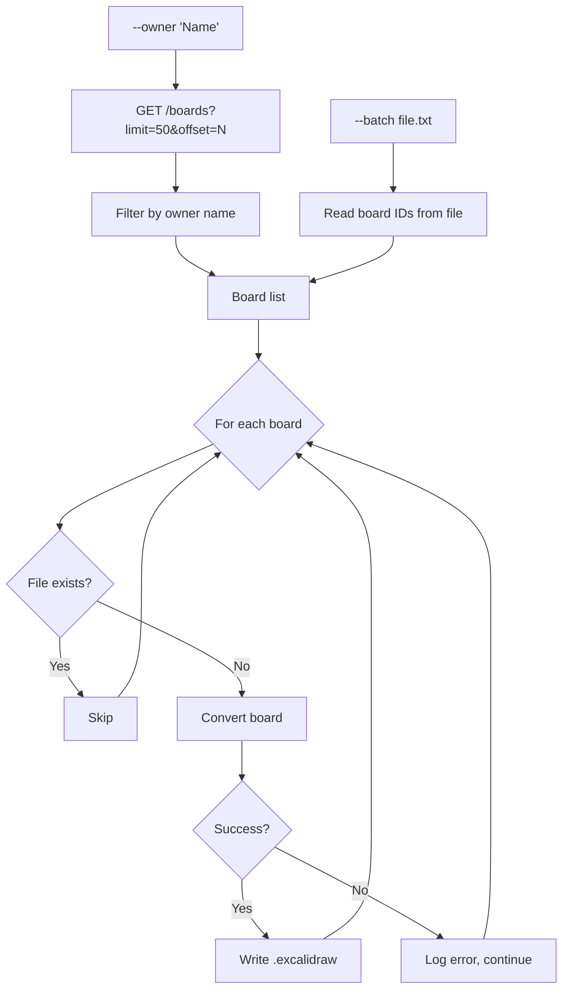

# miro2excalidraw

CLI tool to convert Miro boards to Excalidraw (`.excalidraw`) files via the Miro REST API. Zero dependencies — Python 3.10+ stdlib only.

## Features

- Single board or batch conversion (by owner name or file of board IDs)
- Full-resolution images (PNG, JPEG, SVG) embedded as base64
- Pixel-capped image dimensions to prevent upscaling blur
- Parent-relative position resolution (items inside frames render correctly)
- Video/embed widgets converted to dark cards with clickable links
- Connectors → arrows with start/end bindings
- Rate-limit handling with automatic retry (max 5 retries, 30s timeout)
- Skip-existing for safe batch re-runs
- Deterministic output (same board always produces the same element IDs)

## Requirements

- Python 3.10+
- A [Miro API access token](https://miro.com/app/settings/user-profile/apps)
- No external dependencies (stdlib only)

## Miro API Setup

To use this tool you need a Miro access token. Here's how to get one:

### 1. Create a Miro App

1. Go to [Miro Developer Dashboard](https://developers.miro.com/) and sign in
2. Click **"Create new app"** (you may need to create a Developer team first)
3. Give it a name (e.g. "miro2excalidraw") and accept the terms

### 2. Configure Permissions

In your app settings, enable these scopes:

| Scope | Why |
|-------|-----|
| `boards:read` | Read board items, connectors, and metadata |

That's the only scope needed. The tool only reads data.

### 3. Get Your Access Token

**Option A — Personal Access Token (simplest)**:
In your app's settings page, scroll to **"OAuth access token"** and copy the token.

**Option B — OAuth 2.0 (for multi-user apps)**:
Follow the [OAuth guide](https://developers.miro.com/docs/getting-started-with-oauth) to implement the authorization flow.

### 4. Use It

```bash
export MIRO_ACCESS_TOKEN="your-token-here"
python3 convert.py --board uXjVK3fkjsQ=
```

**Reference links:**
- [Miro REST API v2 docs](https://developers.miro.com/reference/api-reference)
- [Scopes reference](https://developers.miro.com/reference/scopes)
- [Rate limiting](https://developers.miro.com/docs/rate-limiting)

## Architecture

### API Call Flow

The converter makes these calls to the Miro REST API v2:



### Batch Mode Flow



### API Endpoints Used

| Endpoint | Method | Pagination | Purpose |
|----------|--------|-----------|---------|
| `/boards` | GET | Offset (`?limit=50&offset=N`) | List/search boards |
| `/boards/{id}/items` | GET | Cursor (`?limit=50&cursor=...`) | All board items (shapes, text, images, etc.) |
| `/boards/{id}/connectors` | GET | Cursor (`?limit=50&cursor=...`) | Arrows/lines between items |
| `/boards/{id}/resources/images/{resId}` | GET | — | Get signed URL for image download |

### Image Download Pipeline

```mermaid
flowchart LR
    A[Item with imageUrl] --> B[Replace format=preview<br/>with format=original]
    B --> C[GET /resources/images/{id}<br/>→ signed CDN URL]
    C --> D[GET signed URL<br/>→ raw bytes]
    D --> E{Read PNG/JPEG header}
    E --> F[Get pixel dimensions]
    F --> G{Pixels < display size?}
    G -->|Yes| H[Cap to pixel dimensions]
    G -->|No| I[Keep scaled size]
    H --> J[Base64 encode → files map]
    I --> J
```

## Quick Start

```bash
# Set your token (recommended over --token flag)
export MIRO_ACCESS_TOKEN="your-token-here"

# Convert a single board by ID
python3 convert.py --board uXjVK3fkjsQ=

# Convert and open in excalidraw.com
python3 convert.py --board uXjVK3fkjsQ= -o MyBoard.excalidraw
open MyBoard.excalidraw  # macOS; or drag into excalidraw.com
```

## CLI Reference

```
usage: miro2excalidraw [-h] [--token TOKEN]
                       (--board ID | --search QUERY | --owner NAME | --batch FILE)
                       [-o OUTPUT] [--outdir DIR] [--scale FLOAT] [--compact]
```

### Authentication

| Flag | Description | Default |
|------|-------------|---------|
| `--token TOKEN` | Miro API access token | `$MIRO_ACCESS_TOKEN` env var |

The token can be passed via `--token` or the `MIRO_ACCESS_TOKEN` environment variable. Using the env var is recommended to avoid exposing the token in process listings.

### Mode (mutually exclusive, one required)

#### `--board ID` — Convert a single board

```bash
# Board ID is in the URL: https://miro.com/app/board/<BOARD_ID>/
python3 convert.py --board uXjVK3fkjsQ=
python3 convert.py --board uXjVK3fkjsQ= -o Domains.excalidraw
python3 convert.py --board uXjVK3fkjsQ= --outdir ./output
python3 convert.py --board uXjVK3fkjsQ= --scale 0.5 --compact
```

#### `--search QUERY` — Search by name, convert first match

```bash
python3 convert.py --search "Domains"
python3 convert.py --search "Onboarding" -o Onboarding.excalidraw
```

Searches all boards accessible with your token and converts the first match. Prints the matched board name and ID.

#### `--owner NAME` — Batch: convert all boards by owner

```bash
python3 convert.py --owner "Jane Doe" --outdir ./output
python3 convert.py --owner "Jane" --outdir ./output --compact
```

Lists all boards accessible with your token, filters by owner name (case-insensitive substring match on owner or creator name), and converts each one. Output files are named `<board_name>_<board_id_prefix>.excalidraw` to avoid collisions.

#### `--batch FILE` — Batch: convert boards from a file

```bash
python3 convert.py --batch boards.txt --outdir ./output
```

Reads board IDs from a text file (one per line, `#` for comments) and converts each one.

```
# boards.txt
uXjVK3fkjsQ=
uXjVKkfVko0=
# uXjVNOGlxSQ=  (commented out)
```

### Output options

| Flag | Description | Default |
|------|-------------|---------|
| `-o, --output FILE` | Output file path (single mode only) | `<board_name>.excalidraw` |
| `--outdir DIR` | Output directory (batch and single mode) | `.` (current dir) |
| `--scale FLOAT` | Coordinate scale factor | `0.25` |
| `--compact` | Minified JSON (no indentation) | `false` |

### Scale factor

Miro uses large coordinate values (thousands). The `--scale` flag maps them to Excalidraw's coordinate space:

| Scale | Effect | Use case |
|-------|--------|----------|
| `0.25` | Default — compact layout | General use |
| `0.5` | Larger elements | Detailed boards with small text |
| `1.0` | 1:1 with Miro coordinates | Pixel-perfect positioning |

### Batch mode behavior

- **Skip existing**: boards already converted (file exists) are skipped. Safe to re-run.
- **Rate limiting**: automatic retry on HTTP 429 (up to 5 retries per request).
- **Error isolation**: a failing board logs the error and continues to the next one.
- **Filename deduplication**: board ID prefix appended to prevent collisions (e.g. multiple "Untitled" boards).
- **Progress**: prints `[N/total]` for each board with element count.

## Supported Miro Element Types

| Miro Type | Excalidraw Output | Notes |
|-----------|-------------------|-------|
| `shape` | `rectangle`, `ellipse`, `diamond` | Maps shape variants; preserves fill, border, text |
| `text` | `text` | Preserves font size, color, alignment; HTML entities decoded |
| `sticky_note` | `rectangle` + bound `text` | Preserves named colors (light_yellow, yellow, gray, etc.) |
| `frame` | `rectangle` (dashed, semi-transparent) | Title rendered above; children positioned correctly |
| `image` | `image` (embedded) | Full-resolution PNG/JPEG/SVG; pixel-capped to avoid blur |
| `embed` | `rectangle` card with link | Dark card with title + provider; clickable link to video/content |
| `card` | `rectangle` + bound `text` | Title + description, card theme color preserved |
| `connector` | `arrow` | Start/end bindings, arrowheads, caption labels |

### Unsupported Types

`document`, `app_card`, `diagram`, `mindmap_node`, `code`, and other specialized Miro widgets are skipped with a count in the output. See [CONTRIBUTING.md](CONTRIBUTING.md) for how to add support.

## How It Works

1. Fetches all items and connectors from the Miro REST API v2 (paginated)
2. Resolves parent-relative positions (items inside frames) to absolute canvas coordinates
3. Downloads images at `format=original` and reads actual pixel dimensions from PNG/JPEG headers
4. Caps element dimensions to pixel dimensions (prevents upscaling blur)
5. Converts each Miro element type to its Excalidraw equivalent
6. Wires up connector arrows with start/end bindings (O(1) lookup via index)
7. Embeds all image data as base64 in the `files` map
8. Writes deterministic JSON (same board → same element IDs across runs)

## Output

`.excalidraw` files are UTF-8 JSON that can be opened in:

- [excalidraw.com](https://excalidraw.com) (drag & drop)
- VS Code with the [Excalidraw extension](https://marketplace.visualstudio.com/items?itemName=pomdtr.excalidraw-editor)
- [Obsidian Excalidraw plugin](https://github.com/zsviczian/obsidian-excalidraw-plugin)
- Any tool supporting the Excalidraw format

## Testing

Run the test suite (no Miro token needed — tests use mocked data):

```bash
python3 test_convert.py
```

Tests cover:
- HTML stripping and entity decoding
- Color resolution (named + hex)
- Image dimension reading (PNG, JPEG)
- Position resolution (parent-relative → absolute)
- Element conversion (shapes, text, sticky notes, frames, cards)
- Connector/arrow binding wiring
- Deterministic ID generation
- Filename collision avoidance

## Known Limitations

- **Private Vimeo videos**: Excalidraw's native embeddable element strips URL parameters needed for private videos. These are rendered as dark cards with clickable links instead.
- **Image resolution**: Some Miro images (especially frame previews) are stored at lower resolution than their display size. The converter caps dimensions to actual pixels to avoid blur, but can't increase resolution beyond what Miro provides.
- **Nested frames**: Frames inside frames resolve one level of nesting. Deeply nested frames may have positioning errors.
- **Unsupported types**: Some Miro widget types (mindmaps, diagrams, app cards) have no direct Excalidraw equivalent and are skipped.

## License

MIT — see [LICENSE](LICENSE).
